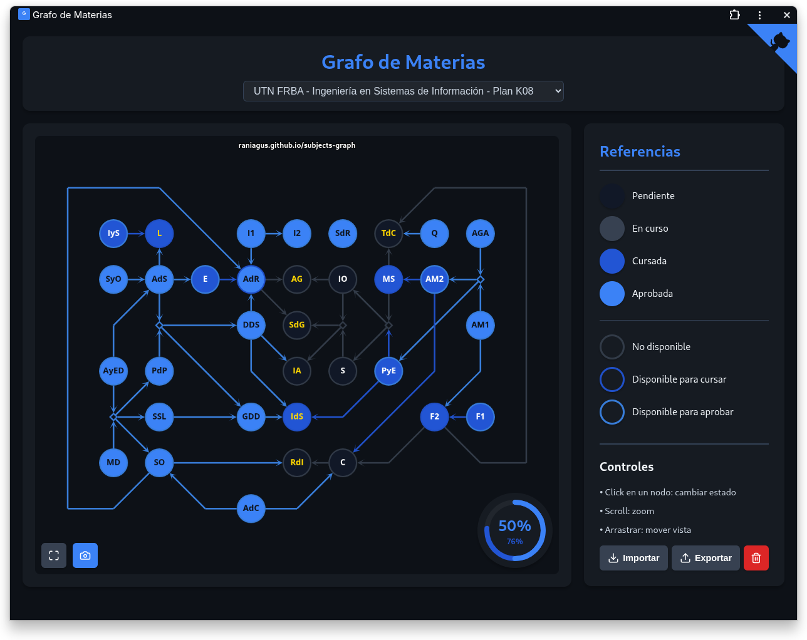

# Grafo de Materias

Interactive web application for visualizing and tracking university subject dependencies as a directed graph. Built with vanilla JavaScript and Cytoscape.js.




## Features

### Graph Visualization

- **Interactive Graph**: Subjects displayed as circular nodes with arrows showing prerequisite relationships
- **Connector Nodes**: Diamond-shaped connectors for complex prerequisite chains
- **Tooltips**: Hover over nodes to see full subject names
- **Pan & Zoom**: Navigate the graph with scroll and drag

### Subject States

Click any subject node to cycle through states:

| State | Spanish | Visual Style |
|-------|---------|--------------|
| Inactive | Inactiva | Dark fill |
| In Progress | En curso | Gray fill |
| Final Pending | Final pendiente | Deep blue fill |
| Approved | Aprobada | Blue fill |

### Border Colors (Availability)

| Border | Spanish | Meaning |
|--------|---------|---------|
| Gray | No disponible | Prerequisites not met |
| Deep Blue | Disponible para cursar | Ready to enroll |
| Light Blue | Disponible para aprobar | Ready to pass (all prereqs approved) |

### Progress Tracking

- **Completion Gauge**: Circular progress showing approved % and final-pending %
- **Auto-save**: Progress saved to LocalStorage per variant
- **Export/Import**: Backup and restore your progress as JSON

### Screenshot Export

- Export graph as PNG with transparent background
- Includes progress gauge and watermark

### Variant Support

- Dropdown to switch between curriculum variants
- Each variant has independent progress tracking

## Tech Stack

- **Vanilla JavaScript** (ES6+)
- **Cytoscape.js** - Graph visualization
- **Lucide Icons** - UI icons
- **CSS Variables** - Theming
- **LocalStorage** - Progress persistence

## Getting Started

### Installation

```bash
git clone https://github.com/RaniAgus/subjects-graph.git
cd subjects-graph
```

### Running Locally

Serve the `docs/` folder with any static file server:

```bash
# Python 3 - serve the `docs/` folder
python -m http.server 8000 -d docs

# Node.js (serve) - serve the `docs/` folder
npx serve docs

# VS Code Live Server
# Open docs/index.html and click "Go Live"
```

### GitHub Pages

The `docs/` folder is configured for GitHub Pages deployment.

## Progressive Web App (PWA) Support

This project implements a basic PWA. It includes:

- `docs/manifest.webmanifest` - Web App Manifest (name, short_name, icons, theme)
- `docs/sw.js` - Service Worker that precaches the app shell and assets (index, CSS, JS, JSON, libraries)
- `docs/offline.html` - a fallback offline page when the app shell can't be served

### Offline behavior

The app caches the full app shell and crucial resources (scripts, styles, `data.json`) on install; therefore, after a successful first visit, the app should load and work offline. In particular:

- Navigation (loading `/` or `index.html`) will return the cached `index.html` when the network is unavailable, allowing the SPA to boot and be usable offline.
- Cached assets are served from the cache; features that depend on remote services (if any) will still fail while offline.
- The `offline.html` fallback is still present and will display if `index.html` isn't cached for some reason.

How to validate offline behavior:

1. Start a local server from the repo root (see instructions above).
2. Open `localhost` in Chrome/Edge DevTools.
3. Open DevTools > Application > Service Workers and ensure `sw.js` is registered and the cache (`subjects-graph-cache-v1`) contains `index.html` and `data.json`.
4. In DevTools > Application > Service Workers, check "Offline" and refresh.
5. Confirm the app still loads and you can interact with it (cycle statuses, export/import, etc.).

Notes: iOS Safari has limited Service Worker support and may not provide the full PWA experience.

## File Structure

```
subjects-graph/
├── docs/
│   ├── index.html        # Main HTML
│   ├── app.js            # Application logic
│   ├── styles.css        # Styles
│   ├── data.json         # Variants and curriculum data
│   ├── cytoscape.min.js  # Graph library
│   └── lucide.min.js     # Icon library
├── README.md
└── LICENSE
```

## Customization

### Adding a New Variant

Edit `docs/data.json`:

```json
{
  "defaultVariant": "frba-k08",
  "variants": {
    "frba-k08": {
      "name": "Ingeniería en Sistemas - UTN FRBA - Plan K08",
      "subjects": [...],
      "links": [...]
    },
    "new-variant": {
      "name": "New Curriculum Name",
      "subjects": [...],
      "links": [...]
    }
  }
}
```

### Subject Format

```json
{
  "id": "AM1",
  "name": "Análisis Matemático I",
  "prerequisites": [],
  "position": { "x": 900, "y": 300 }
}
```

### Connector Links

```json
{
  "id": "link1",
  "sources": ["AM1", "AGA"],
  "destinations": ["AM2", "PyE"],
  "position": { "x": 900, "y": 200 }
}
```

Links can also chain to other links for complex routing:

```json
{ "id": "link19", "sources": ["F2"], "destinations": ["link20"], ... },
{ "id": "link20", "sources": ["link19"], "destinations": ["link21"], ... }
```

## Controls

| Action | Effect |
|--------|--------|
| Click node | Cycle subject state |
| Scroll | Zoom in/out |
| Drag background | Pan view |
| Maximize button | Fit graph to view |
| Camera button | Export as PNG |
| Import/Export | Backup/restore progress |
| Trash button | Reset progress |

## LocalStorage Keys

- `selectedVariant` - Current variant ID
- `graphStatus-{variant}` - Subject statuses per variant

## Contributing

Contributions are welcome! You can help by:

- **Adding new curriculum variants** - Have a different plan or university? Add it to `data.json`!
- **Reporting bugs** - Open an issue if something doesn't work
- **Suggesting features** - Ideas for improvements are appreciated

### Adding Your University's Curriculum

1. Fork the repository
2. Add your variant to `docs/data.json` following the existing format
3. Submit a pull request with your curriculum name in the title

## License

BSD 3-Clause License - see [LICENSE](LICENSE)

## Credits

- [Cytoscape.js](https://js.cytoscape.org/) - Graph visualization
- [Lucide](https://lucide.dev/) - Icons

---

Made with :heart: by [@RaniAgus](https://github.com/RaniAgus)
